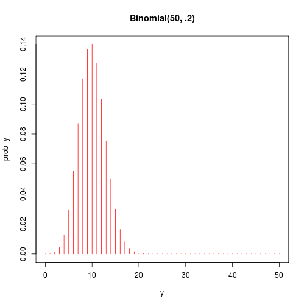
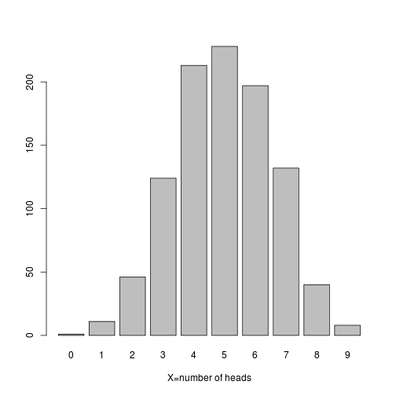

Distribuzione campionaria
=========================
Il concetto di distribuzione campionaria (_sampling distribution_) è fondamentale come connessione tra la statistica e la teoria della probabilità.

Il concetto fondamentale è nel fatto che dal mondo reale possiamo estrarre un campione (_sample_) di dati, su cui possiamo condurre delle misurazioni statistiche, che possiamo usare per stimare il valore dei parametri (che tipicamente non conosciamo) del modello teorico, in cui abbiamo la _popolazione_.

Supponiamo che il nostro esperimento consista nel lancio di dieci monete con probabilità p(testa) che il risultato sia testa.

Sul campione di dieci lanci possiamo contare l'effettivo numero di lanci che hanno avuto come risultato testa e calcolarne il valore <math display="inline"><mrow><mover><mi>p</mi><mo>&and;</mo></mover></mrow></math> = numero di testa/numero di lanci --> <math display="inline"><mrow><mover><mi>p</mi><mo>&and;</mo></mover></mrow></math> = numero di successi/numero di tentativi.

Di fatto, <math display="inline"><mrow><mover><mi>p</mi><mo>&and;</mo></mover></mrow></math> misurato nel campione è una stima del parametro _p_ (il cui valore è non noto) della popolazione.

Se ripetiamo l'esperimento più e più volte, otteniamo valori differenti di <math display="inline"><mrow><mover><mi>p</mi><mo>&and;</mo></mover></mrow></math> che seguono la distribuzione binomiale. Il fatto che i valori <math display="inline"><mrow><mover><mi>p</mi><mo>&and;</mo></mover></mrow></math> differiscono risiede nella variabilità del campione.

La variabilità campionaria in una misurazione è quella che ci aspettiamo di osservare in una statistica, quando cerchiamo di stimare quel parametro del modello teorico, in riferimento alla popolazione. La distribuzione di probabilità seguita dallo stimatore (nel caso in esempio, <math display="inline"><mrow><mover><mi>p</mi><mo>&and;</mo></mover></mrow></math>) è chiamata __distribuzione campionaria__ che, come tale, è dotata di media e deviazione standard.

Stimatori
---------
Supponiamo l'esempio dell'esperimento del lancio di una moneta, ovvero X come uscita di un esperimento di tipo bernoulliano con probabilità di successo di 1/2. Questo esperimento può essere descritto come:
<math display="block">
<mrow>
  <mi>X</mi>
  <mo>=</mo>
  <mo>{</mo>
  <mfrac linethickness="0">
    <mrow>
      <mn>1</mn>
      <mspace width="0.5em" />
      <mtext>con probabilità p</mtext>
    </mrow>
    <mrow>
      <mn>0</mn>
      <mspace width="0.5em" />
      <mtext>con probabilità 1-p</mtext>
    </mrow>
  </mfrac>
</mrow>
</math>
il cui valore atteso è:
<math display="block">
<mrow>
  <mi>E</mi><mo>&ApplyFunction;</mo>
  <mfenced open="(" close=")" separators=",">
    <mrow>
      <mi>X</mi>
    </mrow>
  </mfenced>
  <mo>=</mo>
  <munder>
          <mo>&Sum;</mo>
        <mi>x</mi>
  </munder>
  <mi>x</mi>
  <mi>&popf;</mi>
  <mfenced open="(" close=")" separators=",">
    <mrow>
      <mi>x</mi>
    </mrow>
  </mfenced>
  <mo>=</mo>
  <mn>0</mn>
  <mfenced open="(" close=")" separators=",">
    <mrow>
      <mn>1</mn>
      <mo>-</mo>
      <mi>p</mi>
    </mrow>
  </mfenced>
  <mo>+</mo>
  <mn>1</mn>
  <mi>p</mi>
  <mo>=</mo>
  <mi>p</mi>
</mrow>
</math>
Supponiamo ora di ripetere l'esperimento per n=10 volte. Poiché tutti i possibili valori d'uscita hanno lo stesso valore atteso p, possiamo dire che:
<math display="block">
<mrow>
  <mover accent="true">
          <mi>p</mi>
        <mo>&Hat;</mo>
  </mover>
  <mo>=</mo>
  <mfrac>
    <mrow>
      <msub>
              <mi>X</mi>
            <mn>1</mn>
      </msub>
      <mo>+</mo>
      <msub>
              <mi>X</mi>
            <mn>2</mn>
      </msub>
      <mo>+</mo>
      <mo>&hellip;</mo>
      <mo>+</mo>
      <msub>
              <mi>X</mi>
            <mn>10</mn>
      </msub>
    </mrow>
    <mrow>
      <mn>10</mn>
    </mrow>
  </mfrac>
  <mo>=</mo>
  <mover accent="true">
          <mi>X</mi>
        <mo>&macr;</mo>
  </mover>
</mrow>
</math>
perché per la legge dei grandi numeri sappiamo che in caso di esperimento ripetuto, il risultato medio convergerà con il valore atteso. In pratica, se abbiamo n esperimenti ripetuti che hanno lo stesso valore atteso _p_, il valore atteso della media è esattamente il valore atteso _p_. 
Quindi la stima è pari a
<math display="block">
<mrow>
  <mi>E</mi><mo>&ApplyFunction;</mo>
  <mfenced open="(" close=")" separators=",">
    <mrow>
      <msub>
              <mi>X</mi>
            <mi>i</mi>
      </msub>
    </mrow>
  </mfenced>
  <mo>=</mo>
  <mi>p</mi>
  <mspace width="0.5em" />
  <mtext>allora</mtext>
  <mspace width="0.5em" />
  <mi>E</mi><mo>&ApplyFunction;</mo>
  <mfenced open="(" close=")" separators=",">
    <mrow>
      <mover accent="true">
              <mi>p</mi>
            <mo>&Hat;</mo>
      </mover>
    </mrow>
  </mfenced>
  <mo>=</mo>
  <mi>p</mi>
</mrow>
</math>
possiamo in definitiva concludere che <math display="inline"><mrow><mover><mi>p</mi><mo>&and;</mo></mover></mrow></math> è uno __stimatore__ per _p_. 

In altri termini, supponiamo di essere interessati in _p_ ovvero la proporzione di successi in una distribuzione binomiale, utilizziamo <math display="inline"><mrow><mover><mi>p</mi><mo>&and;</mo></mover></mrow></math> come suo stimatore, sapendo che il valore atteso della sua media è esattamente pari a _p_ e la sua varianza è _p(1 - p)/n_. Se è applicabile il teorema del limite centrale, poi, possiamo affermare che la distribuzione campionaria di <math display="inline"><mrow><mover><mi>p</mi><mo>&and;</mo></mover></mrow></math>  è una normale con media _p_ e varianza _p(1 - p)/n_.

Analogamente, se siamo interessati a <math display="inline"><mrow><mi>&mu;</mi></mrow></math>
 ovvero il valore medio dei risultati di un esperimento ripetuto _n_ volte e con risultati <math display="block">
<mrow>
  <msub>
          <mi>X</mi>
        <mn>1</mn>
  </msub>
  <mtext>,</mtext>
  <msub>
          <mi>X</mi>
        <mn>2</mn>
  </msub>
  <mn>,</mn>
  <mo>&hellip;</mo>
  <mn>,</mn>
  <msub>
          <mi>X</mi>
        <mi>n</mi>
  </msub>
</mrow>
</math>
allora 
<math display="block">
<mrow>
  <mover accent="true">
          <mi>X</mi>
        <mo>&macr;</mo>
  </mover>
  <mo>=</mo>
  <mo>(</mo>
  <msub>
          <mi>X</mi>
        <mn>1</mn>
  </msub>
  <mtext>,</mtext>
  <msub>
          <mi>X</mi>
        <mn>2</mn>
  </msub>
  <mn>,</mn>
  <mo>&hellip;</mo>
  <mn>,</mn>
  <msub>
          <mi>X</mi>
        <mi>n</mi>
  </msub>
  <mo>)</mo>
  <mo>/</mo>
  <mi>n</mi>
</mrow>
</math>
 è uno stimatore per <math display="inline"><mrow><mi>&mu;</mi></mrow></math> in quanto il valore <math display="block">
<mrow>
  <mi>E</mi><mo>&ApplyFunction;</mo>
  <mfenced open="(" close=")" separators=",">
    <mrow>
      <mover accent="true">
              <mi>X</mi>
            <mo>&macr;</mo>
      </mover>
    </mrow>
  </mfenced>
  <mo>=</mo>
  <mi>&mu;</mi>
</mrow>
</math>
ovvero il valore atteso della media calcolata sulla distribuzione campionaria, è pari al valore da stimare. Analogamente, la varianza campionaria è pari alla varianza della popolazione (dal modello teorico) diviso il numero di esperimenti. Infine, per il t.l.c. (con un adeguato numero di esperimenti):
<math display="block">
<mrow>
  <mi>E</mi>
  <mfenced open="(" close=")" separators=",">
    <mrow>
      <mover accent="true">
              <mi>X</mi>
            <mo>&macr;</mo>
      </mover>
    </mrow>
  </mfenced>
  <mo>&asymp;</mo>
  <mi>Norm</mi><mo>&ApplyFunction;</mo>
  <mfenced open="(" close=")" separators=",">
    <mrow>
      <mi>&mu;</mi>
      <mtext>,</mtext>
      <mfrac>
        <mrow>
          <msup>
                  <mi>&sigma;</mi>
                <mn>2</mn>
          </msup>
        </mrow>
        <mrow>
          <mi>n</mi>
        </mrow>
      </mfrac>
    </mrow>
  </mfenced>
</mrow>
</math>


```r
dbinom(0, size = 3, prob = 1/2)
```

```
## [1] 0.125
```

```r
x <- seq(0, 3, by = 1)
prob_x <- dbinom(x, size = 3, prob = 1/2)
cbind(x, prob_x)
```

```
##      x prob_x
## [1,] 0  0.125
## [2,] 1  0.375
## [3,] 2  0.375
## [4,] 3  0.125
```

```r
plot(x, prob_x, type = "h", col = "red", main = "Binomial(3,1/2)")
```

 

```r
sum(x * prob_x)
```

```
## [1] 1.5
```

```r
y <- seq(0, 50, by = 1)
prob_y = dbinom(y, 50, 0.2)
plot(y, prob_y, type = "h", col = "red", main = "Binomial(50, .2)")
```

 

```r
x <- seq(-3, 3, length = 100)
normal01 <- dnorm(x, mean = 0, sd = 1)
plot(x, normal01, type = "l", col = "red", main = "Normal(0,1)")
```

 

```r
rbinom(1, 10, prob = 0.5)
```

```
## [1] 3
```

```r
binom_sample <- rbinom(1000, 10, prob = 0.5)
table(binom_sample)
```

```
## binom_sample
##   0   1   2   3   4   5   6   7   8   9 
##   1  11  46 124 213 228 197 132  40   8
```

```r
freq <- table(binom_sample)
barplot(freq, xlab = "X=number of heads")
```

 


